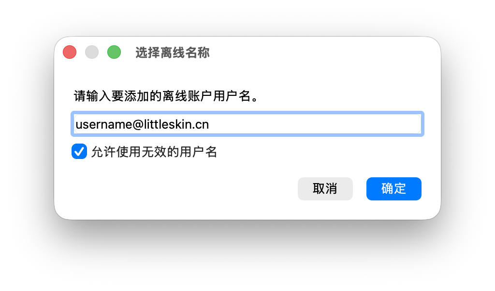

# mmcai_rs

_窃笑一声_

Prism Launcher/MultiMC 本身不支持 authlib-injector（自建/自制/替代/盗版/随你怎么叫/… Yggdrasil 服务器），并且官方表示永远不会实现。因此自己实现了一个。

本项目受 [mmcai.sh](https://github.com/baobao1270/mmcai.sh) 启发，但它只支持 Linux 和 macOS，而我希望在 Windows 使用。

Windows、macOS、Linux 全支持。不需要明文密码。会话自动缓存。微软账号也能直接用。

## 如何使用

1. 从 [Releases](https://github.com/CatMe0w/mmcai_rs/releases) 下载 mmcai_rs，从[这里](https://github.com/yushijinhun/authlib-injector/releases)下载 authlib-injector。

2. 推荐将两个文件放在 `~/.mmcai` 目录下（没有就新建）：

   ```
   ~/.mmcai/
   ├── mmcai_rs          （Windows 下为 mmcai_rs.exe）
   └── authlib-injector-X.Y.Z.jar
   ```

3. 在 Prism Launcher 中添加一个**离线账户**，用户名格式为 `<用户名>@<服务器>`：

   - `<用户名>` 是你在 Yggdrasil 服务器上的账号名。
   - `<服务器>` 是服务器域名或完整 API 地址。
   - 举例：`player@littleskin.cn`、`player@https://example.com/api/yggdrasil`

   

4. 编辑实例，进入**设置 > 自定义命令**，在**包装器命令**中填入 mmcai_rs 的绝对路径：

   ```
   /home/you/.mmcai/mmcai_rs
   ```

5. 启动游戏。首次登录时会弹出系统对话框要求输入密码，之后会话会被自动缓存。

> **提示：** 微软账号无需额外配置。如果当前选择的是微软账号，mmcai_rs 会自动检测并直接透传，不注入 authlib-injector。

## 开源许可

[MIT License](https://opensource.org/licenses/MIT)

例外：文件 `easteregg.jpg` 版权所有，未经许可不得使用。鸣谢：[ZH9c418](https://github.com/zh9c418) & [瑞狩](https://twitter.com/Ruishou_Nyako)。
